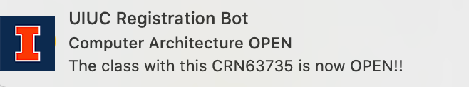
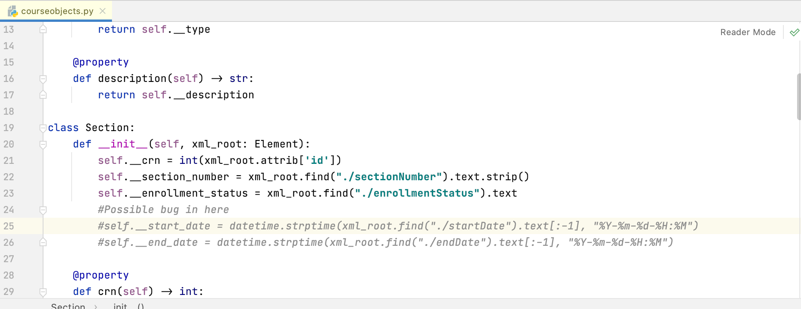

# UIUC-Class-Notification



This is a project that I created to track the registration status of courses. If the course is open, then notify
the user. I created this project so that UIUC students don't have to refresh the registration 1000 times and thus
spend their time on more important tasks.

So far, the two notification sites that I used before both have some disadvantages.
The course explorer site sends out emails for notification, and sometimes it's glitchy, resulting in not sending
any emails. Sometimes it sends out tons of emails, which ended up bombarding my inbox.
The other notification site is coursicle, but it can only keep track of 1 course at a time.
You have to pay to become premium in order to keep track of multiple courses.

## **Dependencies**
* [UIUC-API](https://github.com/rohits2/UIUC-API)
* [Notification library](https://pypi.org/project/notify-py/)

## **Installation**
```console
$ pip install notify-py 
$ sudo pip3 install uiucapi
```

## **How to Use**


```
#Change this line to becomes the tuples of the courses you want and
#their corresponding CRN
courses_you_want = [("CS 233", 63735), ("CS 233", 63733), ("CS 361", 66305)]

#Change this line to code searches for the class in every given seconds
# 4 hours = 60 * 60 * 4
# 5 minute = 60 * 5
# 10 sec = 10
# Don't make the time too short to prevent huge computation that
# might lag your computer
time.sleep(60 * 5)
```
Run the program, and it will notify you if the class is open or have spots. Terminate
the program once you get your spots or doesn't want the program to run

## **Bug Fix**
Due to the recent fix in the formatting of the API, we will have to change the code in the library
for this program to work. 

Go to uiuc_api->course.py and comment out the two lines of code.
It will not change any functionality of this program, since we aren't accessing the start and end date was not used.


## **Future Possible Functionalities**
* Create an user interface for the students to enter the courses
* Allow notification to also show up on phone

## **Contact**
For any bugs and advices, contact me at
**yaowenc2@illinois.edu**.

## **Licence**
Released under the [MIT License](https://github.com/jonschlinkert/update-copyright/blob/master/LICENSE).


